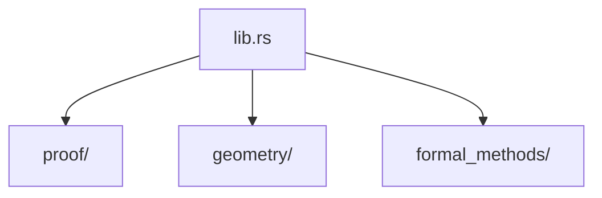

# Documentation Format Comparison: Markdown vs XeTeX

This document analyzes the tradeoffs between Markdown and XeTeX/LaTeX for ProveIt documentation, helping contributors choose the appropriate format for different use cases.

## Overview

| Aspect | Markdown | XeTeX/LaTeX |
|--------|----------|-------------|
| **Primary Use** | Quick reference, GitHub display | Formal publication, comprehensive manual |
| **Learning Curve** | Low | High |
| **Mathematical Notation** | Limited (via extensions) | Full native support |
| **Diagrams** | External tools required | TikZ, native integration |
| **Output Formats** | HTML, PDF (via pandoc) | PDF, DVI, PostScript |
| **Version Control** | Excellent (simple diffs) | Good (more verbose diffs) |
| **Accessibility** | Depends on renderer | Requires careful tagging |

## Detailed Comparison

### 1. Mathematical Typesetting

#### Markdown
```markdown
The identity type `Id_A(a, b)` represents propositional equality.

For dependent functions: `∏(x:A) B(x)` or using LaTeX in markdown: $\prod_{x:A} B(x)$
```

**Limitations:**
- Requires MathJax/KaTeX extension
- Inconsistent rendering across platforms
- No automatic equation numbering
- Limited control over spacing and alignment

#### XeTeX
```latex
\begin{definition}[Dependent Function Type]
Given $A : \Type$ and $B : A \to \Type$, the dependent function type is:
\[
    \Pi_{x : A} B(x) \quad \text{or equivalently} \quad (x : A) \to B(x)
\]
\end{definition}
```

**Advantages:**
- Native mathematical typesetting
- Custom macros for domain notation (e.g., `\Pi`, `\Sigma`, `\Type`)
- Automatic equation numbering with `\label` and `\ref`
- Fine-grained control over spacing, alignment, and symbols
- Professional typography (proper kerning, ligatures)

### 2. Diagrams and Figures

#### Markdown
Requires external tools:
- Mermaid (sequence diagrams, flowcharts)
- PlantUML (UML diagrams)
- SVG/PNG images (manual creation)

```markdown

```

**Limitations:**
- Limited styling control
- Not all platforms render embedded diagrams
- Separate toolchain for complex diagrams
- No mathematical diagrams (commutative diagrams, proof trees)

#### XeTeX
Native TikZ integration:

```latex
\begin{tikzcd}[row sep=large, column sep=large]
    A \arrow[r, "f"] \arrow[dr, "g \circ f"'] & B \arrow[d, "g"] \\
    & C
\end{tikzcd}
```

**Advantages:**
- Native commutative diagrams (`tikz-cd`)
- Proof trees (`bussproofs`, `ebproof`)
- Geometric constructions with precise control
- Consistent styling with document
- Mathematical labels within diagrams

### 3. Cross-References and Citations

#### Markdown
```markdown
See the [Architecture section](#architecture) for details.

References typically use footnotes[^1] or inline links.

[^1]: Author, "Title", Journal, 2024.
```

**Limitations:**
- Manual anchor management
- No automatic numbering
- Limited bibliography support (requires pandoc-citeproc)
- No index generation

#### XeTeX
```latex
As shown in \Cref{thm:univalence}, the univalence axiom implies...

See \cite{hottbook} for the complete development.

\printindex
\printbibliography
```

**Advantages:**
- Automatic numbering (Theorem 3.2, Figure 4.1)
- Smart references with `cleveref` ("Theorem 3.2" vs "theorem 3.2")
- Full BibTeX/BibLaTeX support
- Automatic index generation
- Table of contents, list of figures, list of tables

### 4. Structured Content

#### Markdown
```markdown
> **Definition:** A *geometric proof construction* is...

**Theorem 1.** The univalence axiom states...

*Proof.* By induction on the structure... ∎
```

**Limitations:**
- No semantic distinction between environments
- Manual numbering required
- Styling limited to what renderer supports

#### XeTeX
```latex
\begin{theorem}[Univalence Axiom]
\label{thm:univalence}
The canonical map $\mathsf{idtoeqv} : (A = B) \to (A \simeq B)$ is an equivalence.
\end{theorem}

\begin{proof}
By induction on the identity type...
\end{proof}
```

**Advantages:**
- Semantic environments (theorem, definition, example)
- Automatic numbering within chapters
- Customizable styling per environment
- Proof environment with automatic QED symbol

### 5. Code Listings

#### Markdown
````markdown
```rust
fn verify(&self) -> Result<(), Error> {
    // implementation
}
```
````

**Limitations:**
- Basic syntax highlighting (depends on renderer)
- No line highlighting
- No caption or label support
- Limited styling options

#### XeTeX
```latex
\begin{lstlisting}[
    caption={Verification trait implementation},
    label=lst:verify,
    linebackgroundcolor={\ifnum\value{lstnumber}=3\color{yellow!30}\fi}
]
fn verify(&self) -> Result<(), Error> {
    // implementation
    self.check_invariants()?;  // highlighted line
    Ok(())
}
\end{lstlisting}
```

**Advantages:**
- Fine-grained syntax highlighting customization
- Line numbering with highlighting
- Captions and cross-references
- Escape to LaTeX within listings
- Multiple language definitions

### 6. Typography and Layout

#### Markdown
- Single font (monospace on GitHub)
- Limited control over spacing
- No page layout control
- Responsive (adapts to screen)

#### XeTeX
- Full OpenType font support
- Precise spacing control (kerning, tracking)
- Page layout (margins, headers, footers)
- Two-sided printing support
- Microtype for optimal line breaks

### 7. Accessibility Considerations

#### Markdown
**Pros:**
- Simple structure maps well to screen readers
- Alt text for images is straightforward
- Plain text is inherently accessible

**Cons:**
- Math accessibility depends on MathJax/KaTeX configuration
- No semantic structure for theorems/definitions
- Diagram accessibility requires manual alt text

#### XeTeX
**Pros:**
- PDF/UA compliance possible with `accessibility` package
- Semantic tagging with `tagpdf`
- Alt text for TikZ diagrams

**Cons:**
- Requires explicit accessibility setup
- PDF accessibility is complex
- Math in PDF is challenging for screen readers

### 8. Maintenance and Collaboration

#### Markdown
- Simple syntax, easy to learn
- Clear diffs in version control
- Wide tool support
- Can be edited in any text editor
- GitHub renders automatically

#### XeTeX
- Steeper learning curve
- More verbose diffs
- Requires TeX installation
- IDE support (TeXstudio, Overleaf)
- Compilation required to view

## Recommendations for ProveIt

### Use Markdown For:
1. **README.md** - First contact for users, GitHub rendering
2. **CLAUDE.md** - Quick reference for Claude Code
3. **CONTRIBUTING.md** - Contributor guidelines
4. **Issue/PR templates** - GitHub integration
5. **Inline documentation** - Code comments, doc comments
6. **Quick guides** - Getting started, FAQs

### Use XeTeX For:
1. **Technical Manual** - Comprehensive documentation with proofs
2. **Mathematical Foundations** - Type theory, category theory exposition
3. **API Reference** - When mathematical notation is essential
4. **Academic Papers** - Publications about ProveIt
5. **Formal Specifications** - Precise definitions and theorems
6. **Printed Documentation** - Physical manuals, handouts

### Hybrid Approach

For maximum reach, maintain both:

```
docs/
  README.md              # Quick start (Markdown)
  CONTRIBUTING.md        # Contributor guide (Markdown)
  DOCUMENTATION_COMPARISON.md  # This file
  tex/
    proveit-manual.tex   # Comprehensive manual (XeTeX)
    proveit-manual.pdf   # Compiled output (gitignored)
    Makefile             # Build automation
```

The XeTeX manual serves as the authoritative reference, while Markdown files provide accessible entry points.

## Building the XeTeX Documentation

```bash
cd docs/tex
make              # Build PDF
make clean        # Remove auxiliary files
make distclean    # Remove all generated files
```

Requirements:
- XeTeX (part of TeX Live or MiKTeX)
- Latin Modern fonts
- TikZ and related packages

## Conclusion

| If you need... | Use... |
|---------------|--------|
| Quick editing, GitHub display | Markdown |
| Mathematical proofs with notation | XeTeX |
| Diagrams with mathematical labels | XeTeX |
| Cross-platform readability | Markdown |
| Print-quality output | XeTeX |
| Collaborative web editing | Markdown |
| Comprehensive reference manual | XeTeX |
| Code documentation | Markdown (rustdoc) |

Both formats have their place in ProveIt's documentation ecosystem. The key is choosing the right tool for each documentation need.
